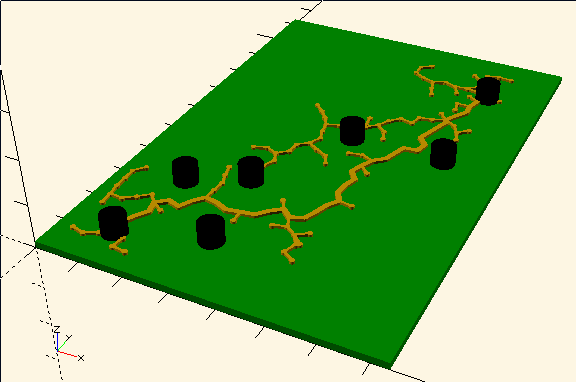

# RoboCup RRT 3dprint

A 3d-printed model showing RoboCup SSL path planning using an rrt.

This model is generated by a C++ program that uses the [RoboJackets RRT library](https://github.com/robojackets/rrt) to generate an rrt spanning from a given start location to a desired destination. This program generates an openscad file listing the coordinates of the items in the tree as well as the positions of the robots, among other info. The main.scad file imports this data file and uses it to draw a 3d model. This model can be opened in openscad and/or used to generate an stl file suitable for import into a 3d printer slicing program.

## Customizing

The positions of the robots as well as their size and the field size can be changed by modifying the [main.cpp](main.cpp) file. Parameters related to the display of the 3d model can be changed in [main.scad](main.scad). After modifying the c++ code, be sure to regenerate the 'out.scad' file with `make out.scad`.
